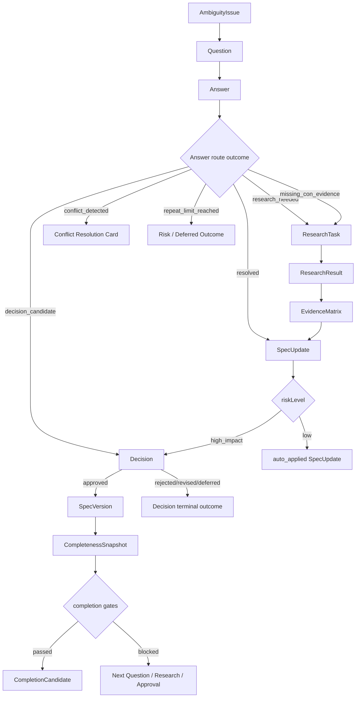

# 16. State/Event Contract

## 목적

State/Event Contract는 Solo Superman Phase 1의 핵심 객체가 어떤 순서와 조건으로 이어져 `Living Product Spec` 완료 후보까지 도달하는지 정의하는 구현 전 계약이다.

이 문서는 `Question → Research → Approval → SpecVersion → Completion`이 끊기지 않는 얇고 넓은 end-to-end trace를 책임진다. 각 루프의 세부 UX, 리서치 품질 산식, 저장소 구현은 기존 전문 문서가 책임진다.

## 범위와 non-goals

포함한다.

- 상태 전이의 시작 조건, 출력, terminal outcome.
- 핵심 이벤트가 남겨야 하는 trace link.
- 무한 질문 루프, confirmation bias, 승인 누락, completion 오판을 막는 guardrail.
- 샘플 dry-run에서 검증 가능한 event trace.

제외한다.

- 런타임/코드 구현 제외.
- DB/API 스키마 상세 제외.
- SQLite table DDL, Tauri command, HTTP endpoint, queue worker 설계.
- 외부 리서치 runtime adapter의 내부 실행 방식.
- 모바일, 팀 협업, 결제, 자동 코드 실행.

## 계약 원칙

1. **Trace-first**: 모든 질문, 근거, 승인, version, completion 후보는 원인이 되는 이전 객체를 추적할 수 있어야 한다.
2. **State before prose**: 보기 좋은 문장보다 어떤 상태가 왜 바뀌었는지가 먼저다.
3. **Terminal outcome required**: 반복 질문, 근거 부족, 승인 거절, research 실패는 열린 상태로 방치하지 않고 명시적 outcome으로 닫는다.
4. **Approval is a gate**: 핵심 Decision은 사용자 승인 전까지 SpecVersion에 확정 반영되지 않는다.
5. **Evidence is bidirectional**: high impact claim은 pro/con evidence 또는 `missing_con_evidence` 상태를 남겨야 한다.
6. **Completion is explainable**: CompletionCandidate는 점수만으로 생성되지 않고 남은 risk와 next validation action을 함께 가진다.

## End-to-end event chain

이 Mermaid는 제품 개념 흐름이다. 노드 이름은 문서 계약이며 DB table 또는 API 이름이 아니다.

## Trace link contract

각 객체는 다음 연결을 보존해야 한다.

| 객체 | 반드시 추적해야 하는 원인 | 반드시 연결해야 하는 후속 결과 |
| --- | --- | --- |
| `AmbiguityIssue` | `SpecSection`, claim, conflict, missing evidence | `Question`, `ResearchTask`, `Decision`, terminal outcome |
| `Question` | `AmbiguityIssue`, `topicKey`, priority reason | `Answer`, route outcome, affected confidence axis |
| `Answer` | `Question`, user input, interpreted meaning | `ResearchTask`, `Decision`, `SpecUpdate`, `deferred` outcome |
| `ResearchTask` | triggering `Answer` or `AmbiguityIssue` | `ResearchResult`, `EvidenceMatrix`, research terminal outcome |
| `EvidenceMatrix` | `ResearchResult`, claim, decision context | `SpecUpdate`, `Decision`, Known Risks, Next Validation Actions |
| `SpecUpdate` | `Answer`, `EvidenceMatrix`, current `SpecSection` | auto-applied update or `Decision` approval request |
| `Decision` | approval card, alternatives, evidence | `SpecVersion` or rejected/revised/deferred terminal outcome |
| `SpecVersion` | approved `Decision`, applied `SpecUpdate` | `CompletenessSnapshot` |
| `CompletenessSnapshot` | current spec, open issues, evidence, decisions | `CompletionCandidate` or next action |
| `CompletionCandidate` | score, gates, risk summary | Founder Brief, completion declaration, deeper question, research reinforcement |

Trace link가 끊긴 상태에서는 completion candidate를 만들 수 없다.

## State/event table

| 단계 | Entry condition | Required output | Terminal outcomes | Guardrail |
| --- | --- | --- | --- | --- |
| Ambiguity analysis | Initial Spec 또는 SpecVersion이 존재함 | `AmbiguityIssue` list, severity, `topicKey` | `open`, `resolved`, `deferred` | 질문이나 리서치로 줄일 수 없는 표현 문제는 high-risk issue가 아니다 |
| Question generation | open issue가 있고 `repeatCount < repeatLimit` | 3~5개 `Question`, confidence axis impact | `question_queued`, `repeat_limit_reached` | 같은 `topicKey`는 한 batch에 1개만 들어간다 |
| Answer routing | `Question`에 `Answer`가 연결됨 | `AnswerRouteOutcome`, affected section, next candidates | `resolved`, `research_needed`, `missing_con_evidence`, `decision_candidate`, `spec_update_candidate`, `conflict_detected`, `deferred`, `repeat_limit_reached` | route outcome 없는 답변은 Decision 후보가 될 수 없다 |
| Research planning | answer 또는 issue가 evidence gap을 만듦 | `ResearchTask` with source intent | `planned`, `cancelled`, `failed` | 사용자가 외부 호출 disclosure를 승인하지 않으면 외부 research를 실행하지 않는다 |
| Evidence synthesis | `ResearchResult`가 도착함 | `EvidenceMatrix`, pro/con/uncertainty, skeptical search | `balanced`, `missing_con_evidence`, `source_quality_insufficient`, `blocked_by_con_evidence` | high impact `pro_only` claim은 decision-ready가 아니다 |
| Spec update suggestion | answer/evidence가 section 변경을 요구함 | `SpecUpdate`, before/after summary, risk level | `auto_applied`, `approval_waiting`, `rejected` | high impact update는 자동 반영하지 않는다 |
| Decision approval | approval card가 사용자에게 제시됨 | `Decision` status, rationale, alternatives | `approved`, `rejected`, `revised`, `deferred`, `risk_accepted` | 사용자 승인 없는 핵심 decision은 SpecVersion으로 고정하지 않는다 |
| Version creation | approved decision과 applied update가 있음 | immutable `SpecVersion` | `created` | rejected/deferred decision은 version 생성 원인이 아니다 |
| Completeness scoring | current spec, issues, evidence, decisions가 갱신됨 | `CompletenessSnapshot`, next best actions | `draft`, `clarifying`, `researching`, `decision_ready`, `spec_ready` | 점수 상승만으로 completion candidate를 만들지 않는다 |
| Completion candidate | score/gates/confidence 기준 충족 | `CompletionCandidate`, Founder Brief draft, remaining risks | `complete`, `deeper_questions`, `research_reinforcement` | high severity issue와 missing con evidence가 숨겨지면 실패다 |

## Route outcome contract

`AnswerRouteOutcome`은 다음 의미로만 사용한다.

| Outcome | 의미 | 다음 행동 |
| --- | --- | --- |
| `resolved` | 답변만으로 issue가 충분히 해소됨 | SpecUpdate 후보 또는 issue closure |
| `research_needed` | 사용자 답변으로 방향은 잡혔지만 외부 근거가 필요함 | ResearchTask 생성 |
| `missing_con_evidence` | 찬성 근거 또는 사용자 확신은 있으나 반대근거 탐색이 부족함 | skeptical search 포함 ResearchTask 생성 |
| `decision_candidate` | primary customer, problem, value, MVP, validation, success, phase boundary 중 핵심 선택이 생김 | Decision Approval Card 생성 |
| `spec_update_candidate` | low-risk 또는 high-impact 문서 변경 후보가 생김 | SpecUpdate 생성 |
| `conflict_detected` | 답변이 기존 Spec 또는 evidence와 충돌함 | Conflict Resolution Card 생성 |
| `deferred` | 지금 풀지 않아도 되며 Known Risks/Open Questions에 남김 | Completion Scorer에 risk marker 전달 |
| `repeat_limit_reached` | 같은 `topicKey` 질문이 기본 3회에 도달함 | severity별 수렴 정책 실행 |

## Repeat-limit event contract

같은 `topicKey`에서 4번째 Question을 만들기 직전에 `repeat_limit_reached`가 먼저 발생해야 한다.

| Severity | 반복 제한 후 outcome | Completion 영향 |
| --- | --- | --- |
| high | Risk Accepted Approval Card 또는 `research_needed` | `risk_accepted` 승인 전까지 completion gate 차단 |
| medium | `research_needed` 또는 `research_insufficient` | Known Risks와 Next Validation Actions에 연결 |
| low | `deferred` | Open Questions에 남기되 completion gate는 기본 차단하지 않음 |

반복 제한은 사용자 피로도를 줄이는 UX 장치이면서 Spec Engine의 수렴 장치다.

## Evidence gate event contract

ResearchTask는 단순 요약으로 끝나지 않고 EvidenceMatrix 상태를 만들어야 한다.

| Evidence 상태 | 의미 | 허용되는 다음 상태 |
| --- | --- | --- |
| `no_evidence` | claim을 뒷받침하거나 반박할 근거가 없음 | `research_insufficient`, follow-up question |
| `pro_only` | 찬성 근거만 있음 | `missing_con_evidence` 또는 skeptical search |
| `missing_con_evidence` | 반대근거를 찾지 못했지만 탐색 기록은 있음 | Known Risks, Next Validation Actions, decision block |
| `balanced` | pro/con/uncertainty가 함께 있음 | SpecUpdate 또는 Decision 후보 |
| `blocked_by_con_evidence` | 반대근거가 핵심 claim을 약하게 만듦 | revise/defer/reject Decision |
| `source_quality_insufficient` | 출처 품질이 낮아 판단에 쓰기 어려움 | research reinforcement |

High impact claim은 `balanced` 또는 명시적 `risk_accepted` 없이 decision-ready가 될 수 없다.

## Approval/version contract

Decision approval은 SpecVersion 생성의 유일한 high-impact 경로다.

- low-risk `SpecUpdate`는 자동 반영될 수 있지만, 어떤 section이 왜 바뀌었는지 기록해야 한다.
- high-impact `SpecUpdate`는 `Decision`으로 전환되어야 한다.
- `Decision.status = approved`일 때만 `SpecVersion` 생성 원인이 된다.
- `rejected`, `revised`, `deferred`는 SpecVersion을 만들지 않고 Decision Log에 terminal outcome으로 남긴다.
- `risk_accepted`는 문제를 해결했다는 뜻이 아니라, 남은 risk를 알고 진행한다는 승인이다.

## Completion event contract

CompletionCandidate는 다음 조건을 모두 만족할 때만 생성한다.

- Composite completeness threshold를 통과한다.
- Confidence Map의 모든 축이 Spec-ready 기준을 충족한다.
- high severity `AmbiguityIssue`가 `resolved`, `risk_accepted`, 또는 명시적 blocker로 분류되어 있다.
- high impact claim이 `pro_only`로 남아 있지 않다.
- 핵심 Decision type이 승인되었거나 Known Risks/Next Validation Actions에 명시적으로 남아 있다.
- 마지막 `CompletenessSnapshot`이 next best action과 remaining risk를 설명한다.

CompletionCandidate의 출력은 완료 선언만이 아니다. 사용자는 다음 중 하나를 선택할 수 있어야 한다.

- 완료 선언.
- 더 깊게 질문.
- 리서치 보강.
- Founder Brief export.

## Failure modes

| 실패 모드 | 감지 신호 | 반드시 남길 outcome |
| --- | --- | --- |
| 무한 질문 루프 | 같은 `topicKey`에서 4번째 질문 후보 생성 | `repeat_limit_reached` |
| Confirmation bias | high impact claim이 `pro_only` | `missing_con_evidence` 또는 decision block |
| 승인 누락 | high-impact update가 자동 반영됨 | approval boundary violation |
| Trace 단절 | Decision이 어떤 Answer/Evidence에서 왔는지 모름 | completion block |
| Stale research | SpecVersion 이후 근거가 오래되거나 반대근거가 갱신됨 | research reinforcement |
| 피로도 무시 | 답변이 짧아지고 보류가 늘지만 새 batch를 계속 제시 | fatigue intervention |
| Completion 오판 | 점수는 높지만 high severity issue가 열려 있음 | completion block |

## 다른 문서와의 관계

- `05-spec-engine.md`는 이 계약을 상태머신과 Engine module 책임으로 실행한다.
- `08-domain-model.md`는 이 계약의 trace link를 표현하는 객체와 필드 후보를 정의한다.
- `14-ambiguity-question-lifecycle.md`는 질문 반복 제한과 answer routing 수렴을 더 자세히 책임진다.
- `15-pro-con-evidence-gate.md`는 EvidenceMatrix의 pro/con gate와 skeptical search를 더 자세히 책임진다.
- `12-validation-and-dry-run.md`는 이 계약이 샘플 dry-run에서 끊기지 않는지 검증한다.
